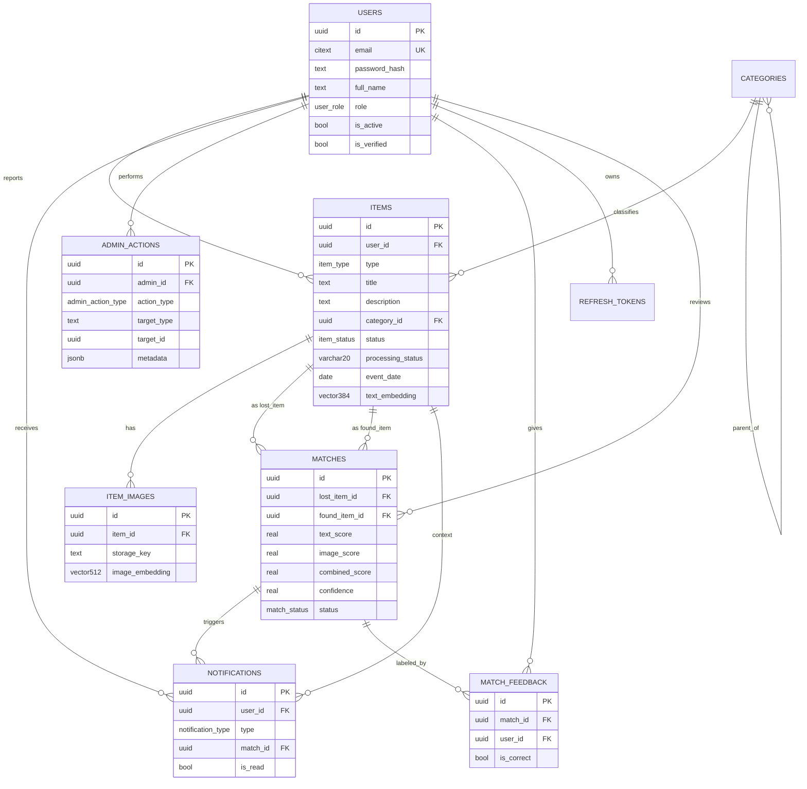

# 02 — Database Schema

PostgreSQL 16 with extensions: `vector` (pgvector), `citext` (case-insensitive
email), `pgcrypto` (UUID generation), and optionally `postgis`/`cube,earthdistance`
for geo radius search (an `earthdistance` haversine is enough for the MVP).

## Design note: one `items` table, not two

The brief lists **Lost Items** and **Found Items** as separate entities.
Physically they are modeled as **one `items` table with a `type` enum
(`lost` | `found`)**. They share every column, the same image/text embedding
pipeline, and the same lifecycle — the only difference is direction of matching.
Splitting them would duplicate the schema, the indexes, the embedding code, and
force `UNION` queries everywhere. The conceptual entities are preserved as
filtered views:

```sql
CREATE VIEW lost_items  AS SELECT * FROM items WHERE type = 'lost';
CREATE VIEW found_items AS SELECT * FROM items WHERE type = 'found';
```

Matching is then simply: *for an item of one type, search items of the other.*

---

## Enumerated types

```
user_role        : user | admin
item_type        : lost | found
item_status      : open | matched | claimed | closed                   ← business lifecycle
item_closed_reason: recovered | expired | withdrawn | duplicate         ← only set when closed
match_status     : pending | suggested | confirmed | rejected | expired
notification_type: match_found | match_confirmed | item_claimed | item_closed | system
notif_channel    : in_app | email
admin_action_type: delete_item | edit_item | resolve_match | ban_user
                   | unban_user | verify_user | change_role
```

> **`items.processing_status`** is a separate, ML-pipeline state — modeled as
> `VARCHAR(20)` with a `CHECK` constraint rather than a PG `enum`, so the worker
> can add/rename pipeline states without an `ALTER TYPE` migration:
> `pending | embedding | matching | ready | failed`.
> It is orthogonal to the business `status` above: an item can be
> `status='open'` (publicly browsable) while `processing_status='matching'`
> (matches not computed yet).

---

## Entities

### `users`
| Field | Type | Notes |
|-------|------|-------|
| id | UUID PK | `gen_random_uuid()` |
| email | CITEXT UNIQUE NOT NULL | case-insensitive |
| password_hash | TEXT NOT NULL | argon2/bcrypt |
| full_name | TEXT NOT NULL | |
| phone | TEXT NULL | contact for handoff |
| role | user_role NOT NULL DEFAULT 'user' | |
| avatar_url | TEXT NULL | |
| is_active | BOOLEAN NOT NULL DEFAULT true | false = banned |
| is_verified | BOOLEAN NOT NULL DEFAULT false | email verified |
| created_at | TIMESTAMPTZ NOT NULL DEFAULT now() | |
| updated_at | TIMESTAMPTZ NOT NULL DEFAULT now() | trigger-updated |

**Relationships:** 1—N `items`, `notifications`, `match_feedback`,
`admin_actions` (as admin), `refresh_tokens`.

---

### `categories`
| Field | Type | Notes |
|-------|------|-------|
| id | UUID PK | |
| name | TEXT NOT NULL | e.g. "Electronics" |
| slug | TEXT UNIQUE NOT NULL | |
| parent_id | UUID NULL FK → categories.id | self-reference for subcategories |
| created_at | TIMESTAMPTZ NOT NULL DEFAULT now() | |

Seeded list (phones, wallets, keys, bags, jewelry, documents, pets, clothing,
electronics, other). Categorization both helps UX and acts as a hard pre-filter
in matching.

---

### `items`  *(serves both Lost Items and Found Items)*
| Field | Type | Notes |
|-------|------|-------|
| id | UUID PK | |
| user_id | UUID NOT NULL FK → users.id | reporter; `ON DELETE CASCADE` |
| type | item_type NOT NULL | `lost` or `found` |
| title | TEXT NOT NULL | |
| description | TEXT NOT NULL | free text |
| category_id | UUID NULL FK → categories.id | `ON DELETE SET NULL` |
| color | TEXT NULL | normalized color label |
| brand | TEXT NULL | |
| status | item_status NOT NULL DEFAULT 'open' | business lifecycle (see policy below) |
| closed_reason | item_closed_reason NULL | set only when `status='closed'` |
| processing_status | VARCHAR(20) NOT NULL DEFAULT 'pending' | ML pipeline state; `CHECK (processing_status IN ('pending','embedding','matching','ready','failed'))` |
| location_text | TEXT NULL | human-readable place |
| location_lat | DOUBLE PRECISION NULL | |
| location_lng | DOUBLE PRECISION NULL | |
| event_date | DATE NOT NULL | date lost / found |
| text_embedding | vector(384) NULL | MiniLM; null until worker fills it |
| closed_at | TIMESTAMPTZ NULL | when it reached `closed` |
| created_by | UUID NULL FK → users.id | actor tracking (`AuthorshipMixin`) |
| updated_by | UUID NULL FK → users.id | last editor / moderator |
| created_at | TIMESTAMPTZ NOT NULL DEFAULT now() | |
| updated_at | TIMESTAMPTZ NOT NULL DEFAULT now() | |

**Relationships:** N—1 `users`, N—1 `categories`, 1—N `item_images`,
1—N `matches` (as `lost_item` or `found_item`).

#### Item lifecycle & ownership policy (decided before M3 CRUD)

```
            ┌────────── re-embed on text edit ──────────┐
            ▼                                            │
  create ─► OPEN ──(match ≥ notify threshold)─► MATCHED ─► CLAIMED ──► CLOSED
            │                                    │          │           ▲
            └────────────── withdraw ────────────┴──────────┴───────────┘
                         (closed_reason = withdrawn)
```

- **OPEN** — active, browsable, eligible as a match candidate.
- **MATCHED** — at least one suggested match exists (set by the matching worker).
  Still browsable; the owner reviews suggestions.
- **CLAIMED** — a match was confirmed and handoff/recovery is in progress
  (both paired items move to CLAIMED together).
- **CLOSED** — terminal. `closed_reason ∈ {recovered, expired, withdrawn,
  duplicate}`; `closed_at` set. Excluded from matching and default browse.

**Ownership rules (enforced in the service layer):**
- **Edit:** owner may edit while `OPEN`/`MATCHED`; editing description/category
  re-enqueues embedding. No edits once `CLOSED`. Admins may edit any item
  (writes `updated_by` + an `admin_actions` row).
- **Delete:** no hard delete by users — a "delete" is a **soft close**
  (`status=closed`, `closed_reason=withdrawn`) so match history and audit
  survive. Admins moderate-delete via `admin_actions` (still soft).
- **Recovery:** confirming a match → both items `CLAIMED`; either owner then
  marks `CLOSED(recovered)`, which records `match_feedback` and notifies the
  counterpart.
- **Expiry:** a periodic job closes long-idle `OPEN` items as
  `CLOSED(expired)`.

> `status` (this lifecycle) stays orthogonal to `processing_status` (the ML
> pipeline). A brand-new item is `status=OPEN` + `processing_status=pending`.

---

### `item_images`
| Field | Type | Notes |
|-------|------|-------|
| id | UUID PK | |
| item_id | UUID NOT NULL FK → items.id | `ON DELETE CASCADE` |
| storage_key | TEXT NOT NULL | backend-agnostic key/path |
| url | TEXT NULL | resolved/served URL (or signed in prod) |
| is_primary | BOOLEAN NOT NULL DEFAULT false | thumbnail/cover |
| image_embedding | vector(512) NULL | CLIP; null until embedded |
| content_type | TEXT NOT NULL | image/jpeg … |
| file_size | INTEGER NOT NULL | bytes |
| width | INTEGER NULL | |
| height | INTEGER NULL | |
| created_at | TIMESTAMPTZ NOT NULL DEFAULT now() | |

**Relationships:** N—1 `items`. An item's image score is the **max** similarity
over its images (see ai-matching.md).

---

### `matches`
A directed pairing between exactly one lost item and one found item.
| Field | Type | Notes |
|-------|------|-------|
| id | UUID PK | |
| lost_item_id | UUID NOT NULL FK → items.id | `ON DELETE CASCADE` |
| found_item_id | UUID NOT NULL FK → items.id | `ON DELETE CASCADE` |
| text_score | REAL NOT NULL | 0–1 cosine-derived |
| image_score | REAL NULL | 0–1; null if either side has no image |
| combined_score | REAL NOT NULL | fused 0–1 |
| confidence | REAL NOT NULL | calibrated 0–1 (shown as %) |
| status | match_status NOT NULL DEFAULT 'suggested' | |
| reviewed_by | UUID NULL FK → users.id | who confirmed/rejected |
| reviewed_at | TIMESTAMPTZ NULL | |
| created_at | TIMESTAMPTZ NOT NULL DEFAULT now() | |
| updated_at | TIMESTAMPTZ NOT NULL DEFAULT now() | |

**Constraints:** `UNIQUE (lost_item_id, found_item_id)` (idempotent re-matching
via upsert); CHECK that the two items differ.
**Relationships:** N—1 `items` (twice), N—1 `users` (reviewer), 1—N
`notifications`, 1—N `match_feedback`.

---

### `notifications`
| Field | Type | Notes |
|-------|------|-------|
| id | UUID PK | |
| user_id | UUID NOT NULL FK → users.id | recipient; `ON DELETE CASCADE` |
| type | notification_type NOT NULL | |
| channel | notif_channel NOT NULL DEFAULT 'in_app' | |
| title | TEXT NOT NULL | |
| body | TEXT NOT NULL | |
| match_id | UUID NULL FK → matches.id | deep-link context |
| item_id | UUID NULL FK → items.id | deep-link context |
| is_read | BOOLEAN NOT NULL DEFAULT false | |
| read_at | TIMESTAMPTZ NULL | |
| created_at | TIMESTAMPTZ NOT NULL DEFAULT now() | |

**Relationships:** N—1 `users`, optional N—1 `matches`, optional N—1 `items`.

---

### `admin_actions`  *(audit log)*
| Field | Type | Notes |
|-------|------|-------|
| id | UUID PK | |
| admin_id | UUID NOT NULL FK → users.id | actor; `ON DELETE SET NULL`* |
| action_type | admin_action_type NOT NULL | |
| target_type | TEXT NOT NULL | 'item' \| 'user' \| 'match' |
| target_id | UUID NOT NULL | id of the affected row |
| reason | TEXT NULL | |
| metadata | JSONB NOT NULL DEFAULT '{}' | before/after snapshot |
| created_at | TIMESTAMPTZ NOT NULL DEFAULT now() | |

\* For a tamper-evident audit trail, keep the row even if the admin user is
removed (store a denormalized `admin_email` too).

---

### `match_feedback`  *(future learning loop — table created in Phase 1)*
| Field | Type | Notes |
|-------|------|-------|
| id | UUID PK | |
| match_id | UUID NOT NULL FK → matches.id | `ON DELETE CASCADE` |
| user_id | UUID NOT NULL FK → users.id | who gave feedback |
| is_correct | BOOLEAN NOT NULL | the supervision label |
| comment | TEXT NULL | |
| created_at | TIMESTAMPTZ NOT NULL DEFAULT now() | |

This is the training signal for re-weighting / calibrating scores later — see
[ai-matching.md](ai-matching.md#7-future-feedback-driven-improvement).

---

### `refresh_tokens`  *(JWT refresh rotation + revocation)*
| Field | Type | Notes |
|-------|------|-------|
| id | UUID PK | |
| user_id | UUID NOT NULL FK → users.id | `ON DELETE CASCADE` |
| token_hash | TEXT NOT NULL | store hash, never the raw token |
| expires_at | TIMESTAMPTZ NOT NULL | |
| revoked_at | TIMESTAMPTZ NULL | set on rotation/logout |
| replaced_by | UUID NULL | reuse-detection chain |
| user_agent | TEXT NULL | |
| ip | INET NULL | |
| created_at | TIMESTAMPTZ NOT NULL DEFAULT now() | |

---

## ER diagram (text)



### Relationship summary (cardinality)
```
User      1───∞  Item            (a user reports many items)
User      1───∞  Notification
User      1───∞  AdminAction      (admins only)
User      1───∞  RefreshToken
Category  1───∞  Item
Category  1───∞  Category         (parent/child)
Item      1───∞  ItemImage
Item      1───∞  Match            (as lost_item_id)
Item      1───∞  Match            (as found_item_id)
Match     1───∞  Notification
Match     1───∞  MatchFeedback
```

---

## Indexes

```sql
-- Lookups & filters
CREATE INDEX idx_items_type_status     ON items (type, status);
CREATE INDEX idx_items_proc_status     ON items (processing_status);   -- worker scans pending/failed
CREATE INDEX idx_items_category        ON items (category_id);
CREATE INDEX idx_items_user            ON items (user_id);
CREATE INDEX idx_items_event_date      ON items (event_date);
CREATE INDEX idx_notifications_user_unread ON notifications (user_id, is_read);
CREATE INDEX idx_matches_lost          ON matches (lost_item_id);
CREATE INDEX idx_matches_found         ON matches (found_item_id);

-- Full-text fallback for keyword search
CREATE INDEX idx_items_fts ON items
  USING gin (to_tsvector('simple', title || ' ' || description));

-- Vector ANN (cosine). HNSW: better recall/latency than IVFFlat for MVP sizes.
CREATE INDEX idx_items_text_vec  ON items
  USING hnsw (text_embedding vector_cosine_ops);
CREATE INDEX idx_images_vec      ON item_images
  USING hnsw (image_embedding vector_cosine_ops);
```

**Migrations** are managed with **Alembic** (the `vector` columns use the
`pgvector.sqlalchemy.Vector` type). The `updated_at` columns are maintained by a
shared `BEFORE UPDATE` trigger.
